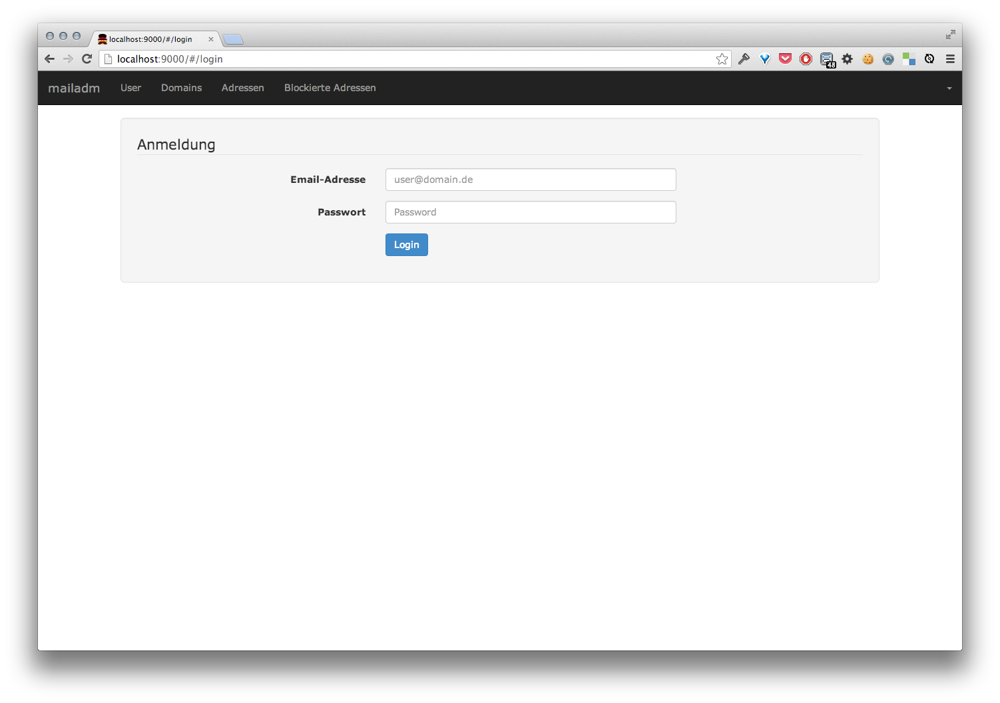

# mailadm #

> A webfrontend to manage and monitor your mailserver.

Simple webfrontend to manage my mailserver running postfix, dovecot and postgresql.
Currently it's just a little side-project and and barely useful for somebody except me.
If the project grows more stable and gets more features, this may change.

## Requirements ##

* Postgresql
* Postfix
* Dovecot

## Run ##

* import mail.schema.sql to your postgres db
* cp server/config.json.dist server/config.json
* edit server/config.json and adjust to your setup
* npm install
* node server/main.js
* gulp

## Todo ##

* provide required servers/services as docker images
