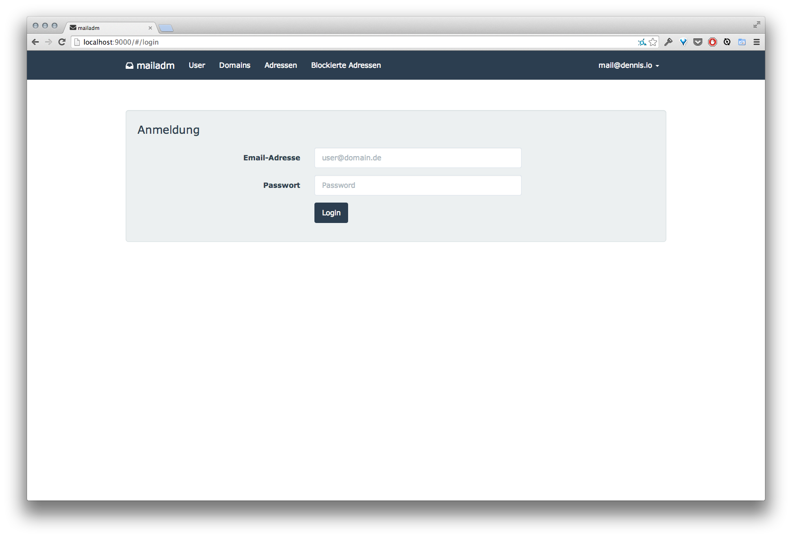

# mailadm #

Simple webfrontend to manage my mailserver running postfix, dovecot and postgresql.

## run ##

* cp server/config.json.dist server/config.json
* edit server/config.json and adjust to your setup
* npm install
* node server/main.js
* gulp

## todo ##

too much.
